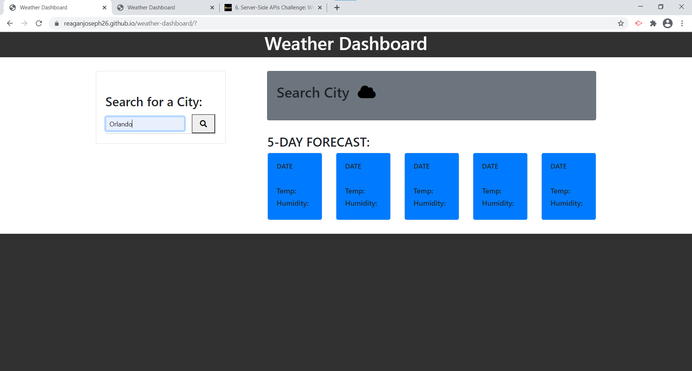
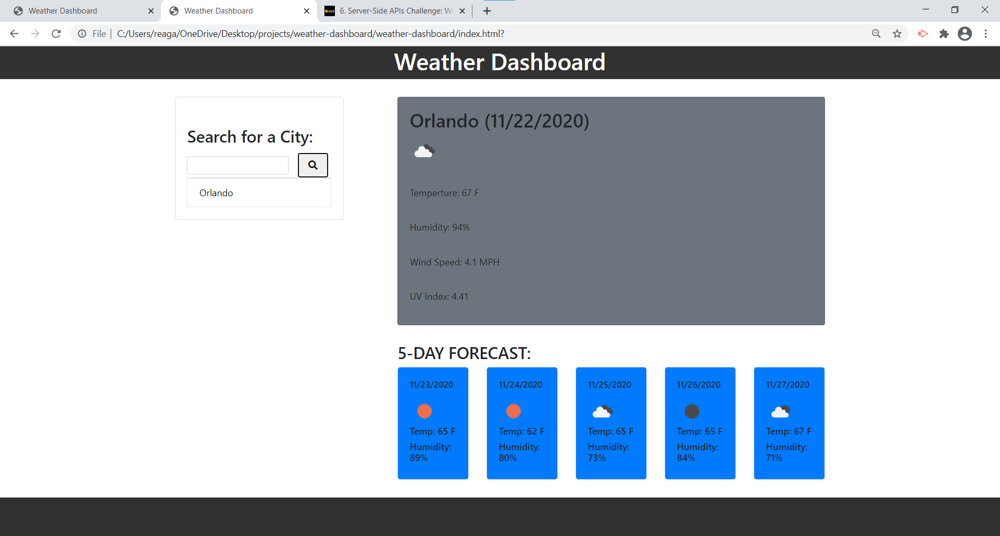

# weather-dashboard
A weather app that grabs the current and five day weather information for any applicable city name. 

## Open Weather API 
* Set up a free Open Weather Api key here: https://openweathermap.org/api
* Side Note: live production will not run as intended without an api key 
* The Api key attached to this project is hidden intentionally 

# HTML
* Set up basic with appropiate id
* Link bootstrap CDN to the html 
* Link Javascript files at the end of body 

# CSS
Bootstrap classes

# JavaScript 
- Fetch Data from API call. 
- Read through response data to locate temp, humidity, etc
- Use that data to set up a function tha will display all the current weather conditions
- Use Open weather api make a nested fetch call for the UV value
- Add an end point of forecast to get the weather conditions for a 5 day forecast 
- Set and Pull local storage 
- Run function on eventListner "click"

ScreenShot: 
            

Deplpyed Application Link: https://reaganjoseph26.github.io/weather-dashboard/

